# Workflow & Process Diagrams — Enshrine Associate Management Portal

**Version:** 1.0 · **Source of truth:** `Enshrine_Portal_PRD.md` v1.2 · **Anchors:** `02_Database_Diagram.md`, `05_RBAC.md`
**Engine:** PostgreSQL + Prisma · **Money:** `NUMERIC(14,2)` SGD · **Region:** Singapore (NRIC, PayNow, PDPA, GIRO, GST-ready/off)

This document captures the operational workflows of the portal as renderable **Mermaid** diagrams. Every entity, enum value, role and rate referenced here is taken verbatim from the anchor docs so the diagrams stay in lockstep with the schema (`02_Database_Diagram.md` §3 enums) and access model (`05_RBAC.md` §1–§3).

---

## Legend

Conventions used across all diagrams below:

- **Roles** (enum `app_role`): `Admin`, `Accounts`, `SalesDirector`, `SalesManager`, `Consultant`.
- **Designations** (org rank, enum `designation`): `Sales Consultant`, `Assistant Sales Manager` (ASM), `Sales Manager` (SM), `Sales Director` (SD).
- **Enum literals** are shown exactly as in `02_Database_Diagram.md` §3 (e.g. `approval_status = Approved`, `invoice_status = Outstanding`).
- **Entities / tables** are written in the schema's casing (e.g. `sales_transactions`, `commission_ledger`, `monthly_payouts`).
- Flowchart shapes: `[ ]` process · `{ }` decision · `([ ])` start/end · `[( )]` data store / table write.
- A dashed arrow (`-.->`) denotes an asynchronous / notification / recompute path.
- The **gating overlay** (`approval_status = Approved` AND `associate_status = Active`) is the precondition for closing, payouts, contacts export and dashboards (`05_RBAC.md` §2).

---

## 1. End-to-End Pipeline

The full lifecycle from recruitment to dashboards. An applicant is recruited and e-signs, HR approves and activates which opens the virtual office, the associate submits a sale, Accounts/HR verifies it into a `sales_transactions` record, invoices/installments are issued, the auto commission engine writes the `commission_ledger`, eligible lines aggregate into `monthly_payouts`, a GIRO bank file is generated, and everything reconciles into scoped dashboards.

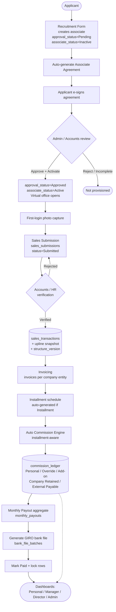

---

## 2. Recruitment & Onboarding

Detail of the first leg. The recruitment form creates a `Pending`/`Inactive` associate with the next `EN####` code, the system auto-generates the agreement, the applicant e-signs in-app (with a **PDF-download fallback** for those who cannot sign on-screen), Admin/HR reviews, and on Approve+Activate the login is provisioned. First login is blocked until a photo is captured.

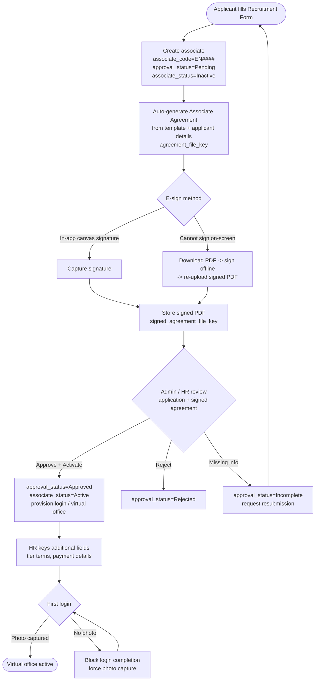

---

## 3. Associate Status State Machine

Two independent enums govern an associate's lifecycle and together form the gating rule. `approval_status` is the HR review outcome; `associate_status` is the operational state. Only `approval_status = Approved` **AND** `associate_status = Active` lets an associate act as a closer, receive payouts, appear in Contacts export, or appear in manager dashboards (`05_RBAC.md` §2). `Terminated`/`Suspended` stop *future* eligibility but retain history.

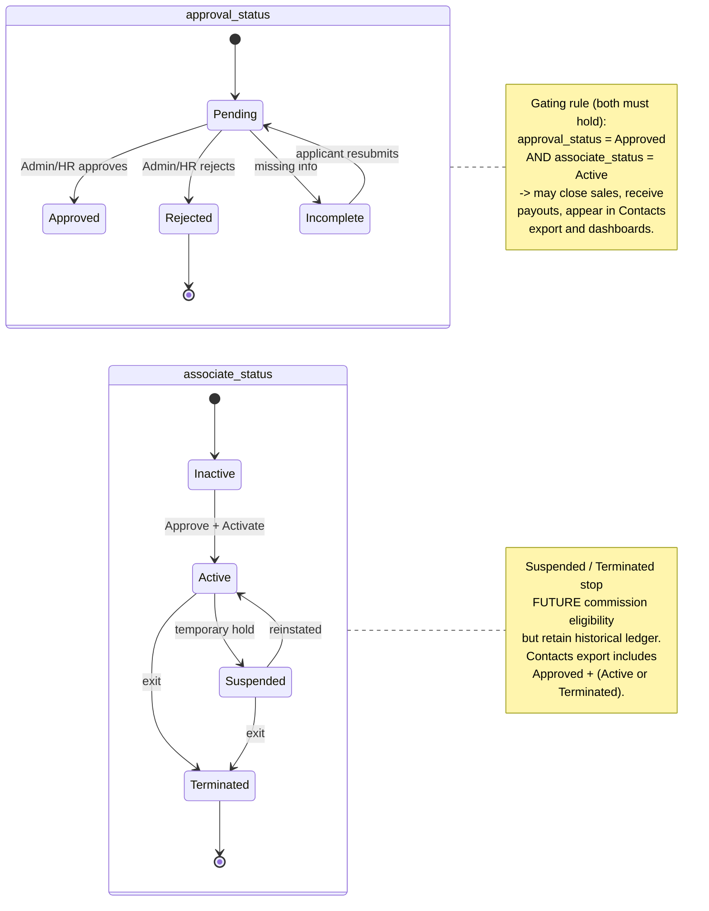

---

## 4. Sales Submission → Verification → Transaction

The handoff between the closing **Associate**, the **System**, and **Accounts/HR**. A submission (`sales_submissions.status = Submitted`) is not official; only Accounts/HR verification promotes it to a `sales_transactions` row, which snapshots the upline chain and resolves the structure version by sales date. No commission appears on any dashboard before verification.

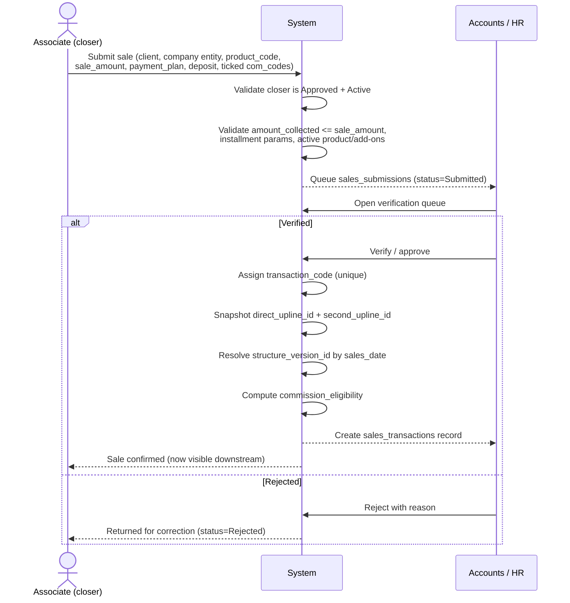

---

## 5. Invoicing & Installment Lifecycle

Invoices are driven from the transaction. A full-payment sale gets one invoice; an installment sale auto-generates a schedule (one invoice per installment) using `installment = round((total − deposit) / n)` with residual on the final installment. Invoices carry `invoice_status ∈ {Outstanding, Paid, Cancelled}`; marking an invoice Paid (no payment gateway in v1) feeds eligibility. Plans are adjustable mid-way, preserving paid history.

```mermaid
flowchart TD
    A[(sales_transactions)] --> B{payment_plan}
    B -->|Full Payment| C[Issue one invoice<br/>invoice_type:<br/>Computer-Generated or Signature]
    B -->|Installment| D[Create installment_plans<br/>total, deposit, installment_count]
    D --> E[Auto-gen installment_schedule<br/>installment = round((total-deposit)/n)<br/>residual on final]
    E --> F[Issue one invoice per installment<br/>installment_index set]
    C --> G[Invoice number per company<br/>INV-COMPANY-YYYY-#####]
    F --> G
    G --> H[(invoices status=Outstanding)]
    H --> I{Mark as Paid<br/>by Admin/Accounts}
    I -->|Paid| J[(status=Paid<br/>paid_date stamped)]
    I -->|Voided| K[(status=Cancelled<br/>terminal)]
    J -.-> L[Recompute eligibility<br/>re-run engine idempotently]
    M[Adjust plan mid-way] --> E
    M -.-> N[Preserve paid installments<br/>recompute remaining only]
```

Invoice status lifecycle (per invoice / per installment invoice):

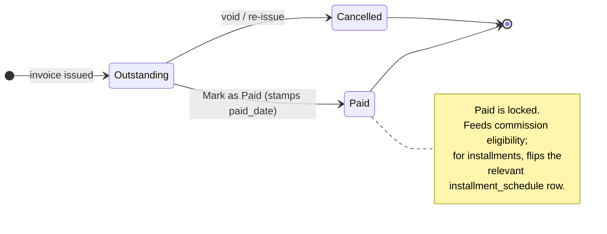

---

## 6. Auto Commission Engine

Per verified + eligible transaction, the engine computes the closing commission, the company cut pool, overrides up the chain by upline designation (ASM/SM/SD), company retained, add-on com codes, and the external-product branch — then writes `commission_ledger` lines. Overrides are paid **out of the pool**, so they never reduce the closer's net. The external branch routes the bulk to the provider (`External Payable`) and keeps only a small `external_company_retained_pct`. A manual override can supersede the computed value (Admin only).

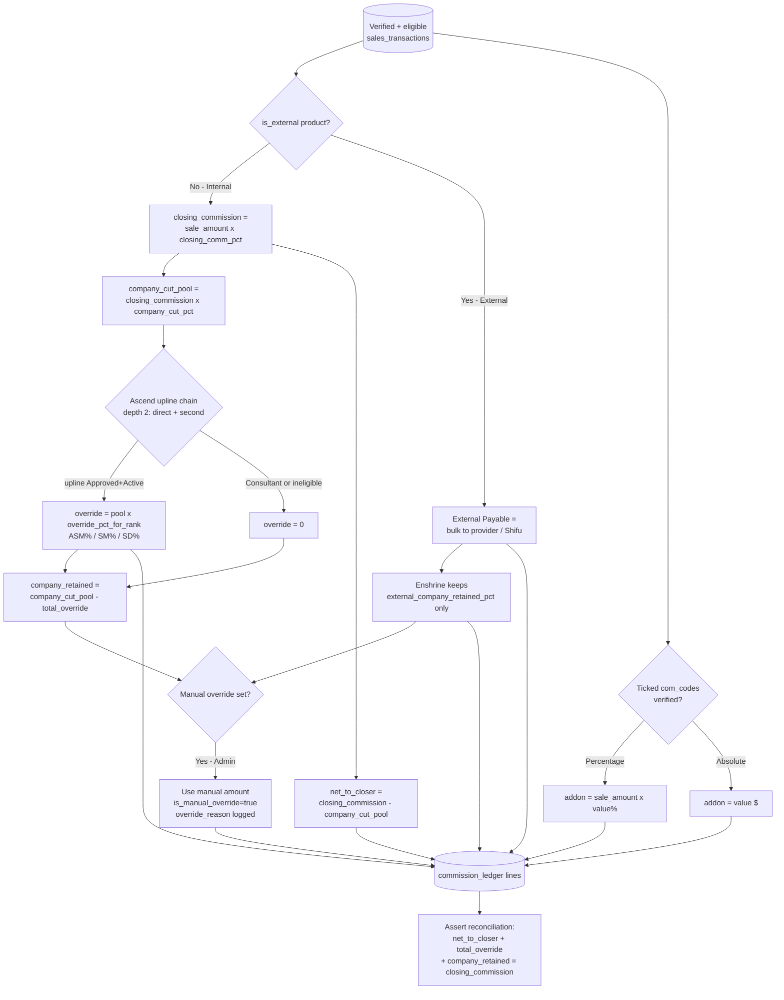

Worked example (`PRD §8.2` — must pass as a test): a $10,000 internal sale with direct upline = SM and 2nd upline = SD.

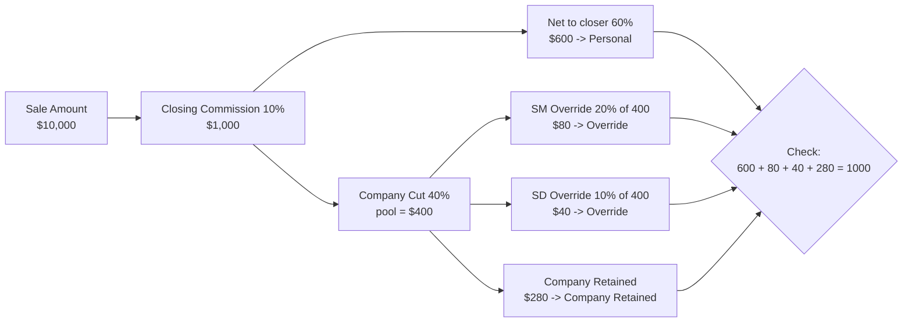

---

## 7. Commission Eligibility / Installment Trigger

`commission_eligibility ∈ {Eligible, Pending Collection, Partially Eligible, Ineligible}`. Ineligible means closer was not Approved+Active at sale time or the sale is unverified. Full payment becomes Eligible once verified and fully collected. Installment sales default to paying out on the **3rd installment** (`commission_payout_installment_threshold`, configurable); before that they sit as `Pending Collection`. Eligibility recomputes whenever an installment invoice is marked Paid.

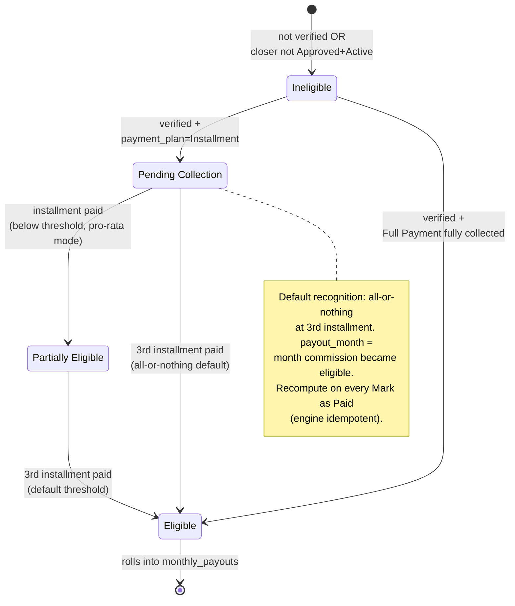

---

## 8. Monthly Payout & Bank File

Eligible `commission_ledger` lines aggregate per associate per `payout_month` into `monthly_payouts` (`Total Payable = Personal + Override + Add-on`). The payout row moves `payout_status` Pending → Approved → Paid (Cancelled terminal). A GIRO bank file (`bank_file_batches`) is generated for the selected approved payouts — **associate payout only**, not vendor/supplier payments — and marking Paid stamps the date and locks the row.

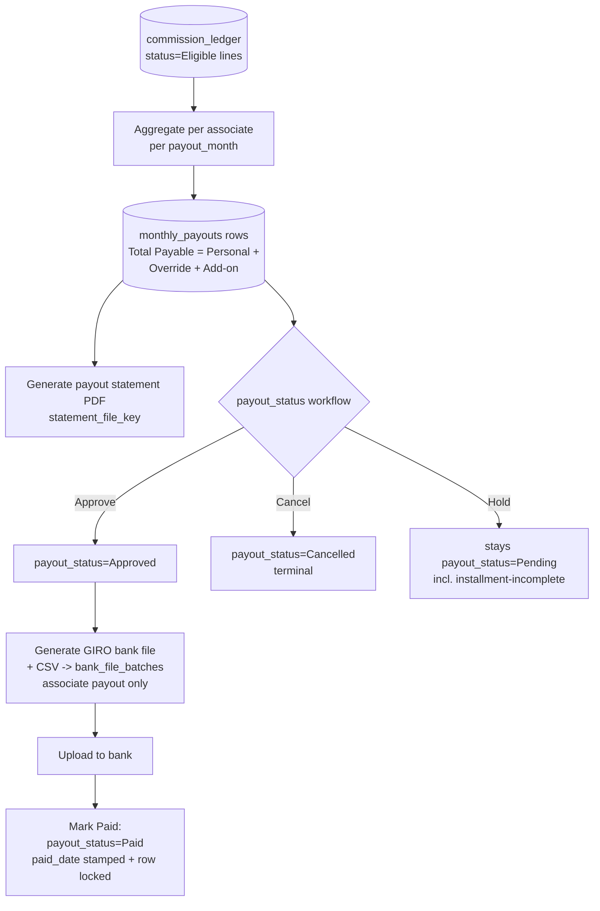

Payout status lifecycle:

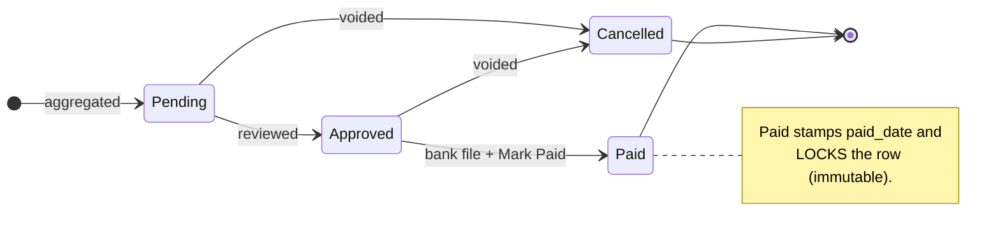

---

## 9. Notice Broadcast

Admin/Accounts posts a notice (title, body, optional attachment, audience All/Team/Role). The system writes the `notices` row, delivers an in-app notification (bell + count) and an email, and surfaces it in the home feed. The associate reads it; an optional `notice_reads` row records the read.

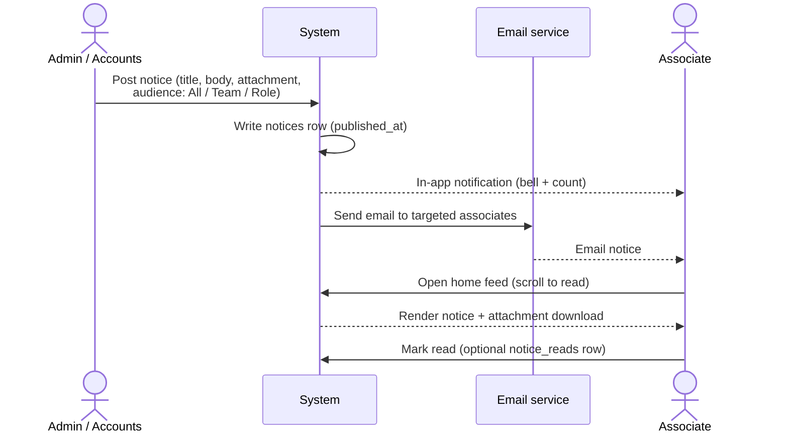

---

## 10. Vendor Referral First-Claim

An associate submits the Referred (Marketing) Partnership Registration with the agreement upload. The system records a **timestamped** `vendor_referrals` row; that `submitted_at` timestamp is the first-claim key. All associates get a **view-only** registry. If two associates approach the same vendor, the conflict is resolved by the earliest timestamp.

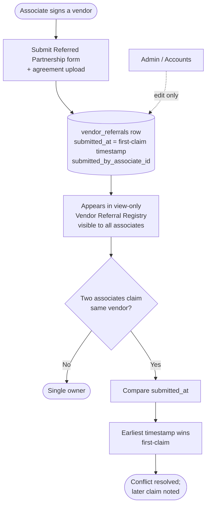

---

*End of Workflow & Process Diagrams v1.0 — 10 diagrams.*
