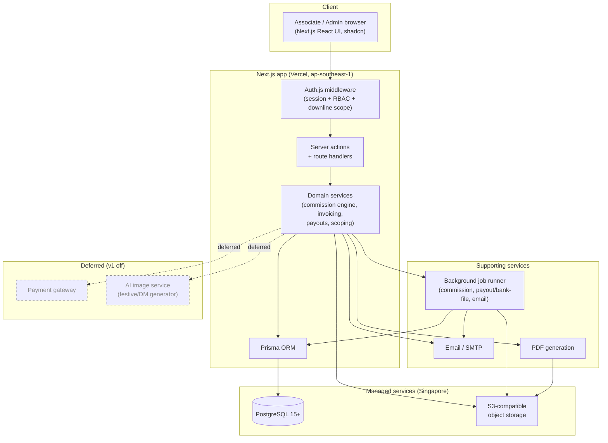

# Software Architecture Document — Enshrine Associate Management Portal

**Version:** 1.0 · **Source of truth:** `Enshrine_Portal_PRD.md` v1.5 (§4, §8, §10) · **Anchors:** `02_Database_Diagram.md`, `05_RBAC.md`
**Status:** spec/PRD stage — to be built by Codex.

---

## 1. Context & goals

Enshrine is a single-tenant **CRM + HRMS "virtual office"** for a Singapore funeral-services and pet-aftercare business. Commission-based **associates** are recruited, onboarded (e-sign), and run their entire sales lifecycle online: submit sales, raise invoices (multi-company), have commission computed by an automated engine, and receive monthly payouts via a bank GIRO bulk file. Managers and directors see dashboards scoped to their downline; Admin/Accounts run verification, the commission engine, and payouts.

**Architectural goals**

- **Correct, auditable money.** Commission math reconciles to the cent (PRD §8.2); the engine is idempotent and re-runnable.
- **Strict access control.** RBAC + recursive downline scoping enforced server-side on every query (`05_RBAC.md`).
- **Data residency & privacy.** All data at rest in Singapore (`ap-southeast-1`); NRIC/bank encrypted (PDPA).
- **Virtual office.** One login, self-service; responsive; dashboards < 2s at 1,000 associates (PRD §10).
- **Replaceable seams for deferred features.** Payment gateway, AI festive generator, and the future Vendor/Logistics LMS are out of scope for v1 but must not be designed out.

---

## 2. Chosen stack & rationale

| Layer | Choice | Rationale |
|---|---|---|
| Frontend | Next.js 14+ (App Router), React, TypeScript, Tailwind, shadcn/ui | One framework for UI + server logic; App Router server components reduce client data exposure; shadcn for fast, consistent admin-style UI. |
| Application logic | Next.js **server actions** + route handlers | Co-locate mutations with the app; type-safe server boundary; route handlers expose JSON endpoints (`04_API_Documentation.md`) and webhooks/jobs triggers. |
| Database | PostgreSQL 15+ + **Prisma** | Strong relational integrity for hierarchy, ledger, and invoices; Postgres enums, `NUMERIC(14,2)`, recursive CTEs for downline closure; Prisma gives typed access + migrations. |
| Auth | NextAuth (Auth.js) | Email/password + role claims, HTTP-only cookie sessions; CSRF protection; pluggable OAuth later. |
| Object storage | S3-compatible (S3 / R2 / Supabase) | Store agreements, invoices, signed docs, photos as keys; serve via short-lived signed URLs; Singapore region. |
| PDF generation | `@react-pdf/renderer` or Puppeteer | Server-side invoices, payout statements, agreements with per-company stamps. |
| Background jobs | Scheduled/queued runner | Commission runs, payout/bank-file generation, email dispatch — decoupled from request cycle. |
| Hosting | Vercel + managed Postgres (Supabase / Neon / RDS) | `ap-southeast-1` for residency; serverless scaling; pooled DB connections. |

---

## 3. High-level architecture



Request path: the browser hits the Next.js app; Auth.js middleware resolves `{ userId, role, associateId }`, applies the permission matrix and downline-closure scope, then server actions invoke domain services that read/write through Prisma to Postgres. File reads/writes use object storage (signed URLs); PDFs render server-side and are stored back to object storage. Long-running or batched work (commission runs, payout aggregation, bank-file export, bulk email) is dispatched to the background job runner. The payment gateway and AI image service are shown dashed — deferred in v1.

---

## 4. Module / domain breakdown

Maps to the PRD's 8+ modules and the schema in `02_Database_Diagram.md`.

| Domain module | PRD ref | Key entities | Responsibility |
|---|---|---|---|
| Recruitment & Onboarding | §6.1 | `associates`, `documents`, `users` | Recruitment form → Pending/Inactive associate (`EN####`), auto-agreement, e-sign, approval, first-login photo, login provisioning. |
| Associate Master / HR | §6.2 | `associates` | Hierarchy (`direct_upline_id`/`second_upline_id`), approval/active status, payment details, Contacts export. |
| Commission Structure | §6.5 | `products`, `com_codes`, `commission_structure_versions` | Per-product rates, add-on com codes, upgrades (`parent_product_id`), internal vs external, effective-date versioning. |
| Sales Submission | §6.3 | `sales_submissions` | Associate-submitted sales with ticked add-ons; pre-verification. |
| Sales Transactions & Verification | §6.4 | `sales_transactions` | Accounts/HR verify → unique `transaction_code`, upline snapshot, structure-version resolution, eligibility. |
| Invoicing & Installments | §6.5b | `companies`, `invoices`, `installment_plans`, `installment_schedule` | Multi-company invoices (Computer-Generated / Signature), per-company numbering, Outstanding tab, Mark-as-Paid, auto schedules. |
| Commission Engine & Ledger | §6.6, §6.7, §8 | `commission_ledger` | Compute closing commission, pool, overrides, add-ons, retained, external-payable; idempotent; manual override. |
| Payouts & Bank File | §6.8 | `monthly_payouts`, `bank_file_batches` | Aggregate eligible ledger lines per associate/month, statement PDFs, GIRO bulk-payout file, status workflow. |
| Dashboards & Contacts | §6.9 | (reads above) | Personal / Manager (SM) / Director (SD) / Admin scoped views; Contacts CSV. |
| Notices | §6.10 | `notices`, `notice_reads` | In-app + email announcements; home feed. |
| Documents & Agreements | §6.11 | `documents` | Templates + "My Agreement" repository. |
| Vendor Referral Registry | §6.13 | `vendor_referrals` | View-only directory; `submitted_at` first-claim timestamp. |
| Audit & RBAC (cross-cutting) | §5, §9 | `audit_log`, `users` | Permission checks, downline scoping, audit trail. |

---

## 5. Suggested folder structure

```
app/            # Next.js App Router: route groups (/admin, /accounts, /sales, /team, …),
                #   server actions, route handlers; UI per 05_RBAC route map
components/      # Shared UI (shadcn/ui), forms, tables, dashboard tiles
lib/            # Cross-cutting: env config, auth helpers, money (NUMERIC/cents), PII
                #   encryption, signed-URL helpers, RBAC policy (can(principal,action,resource))
server/         # Domain services (framework-agnostic, testable):
                #   commission-engine/, invoicing/, payouts/, scoping/, associates/
prisma/         # schema.prisma, migrations/, seed.ts (prototype seed)
jobs/           # Background jobs: commission-run, payout-aggregate, bank-file-export, email
```

Rationale: `server/` holds pure domain logic (commission math, eligibility, scoping predicates) independent of Next.js so it is unit-testable (PRD §15); `app/` is thin glue that authorizes then delegates; `jobs/` shares the same `server/` services to stay consistent with request-path behaviour.

---

## 6. Cross-cutting concerns

- **Auth & RBAC** — server-side enforcement on every query; recursive downline-closure CTE; out-of-scope → 403. Canonical rules in `05_RBAC.md`; central `can(principal, action, resource)` policy.
- **Money** — `NUMERIC(14,2)` SGD (or integer cents); never floats. Round each money value to 2dp; residual pushed into Company Retained so splits reconcile to `closing_commission` (PRD §8.1).
- **PII encryption** — `nric`, `bank_account_number` encrypted at rest (AES-256-GCM via `PII_ENCRYPTION_KEY`), masked in UI, decrypt restricted to Admin/Accounts and audit-logged.
- **Audit log** — `audit_log` is append-only; every privileged action (approve, verify, run engine, manual override, mark paid, rate change, payout status change) records actor + before/after.
- **Idempotent commission engine** — re-running deletes + reinserts ledger lines per transaction; safe after each installment payment or rate change; no duplicate lines.
- **Soft-delete** — `archived_at` everywhere; no hard deletes; scoping CTEs exclude archived rows.
- **Structure versioning** — transactions resolve the `commission_structure_versions` row valid for their `sales_date`; historical payouts never recompute (PRD §8.4).
- **Upline snapshot** — `direct_upline_id`/`second_upline_id` snapshotted onto `sales_transactions` at verification so later hierarchy edits don't rewrite history.

---

## 7. Background jobs

| Job | Trigger | Behaviour |
|---|---|---|
| **Commission run** | After verification, after an installment invoice is marked Paid, after a rate change, or on-demand | Recompute ledger lines per affected transaction; idempotent (delete+reinsert); update eligibility (installment threshold, default 3rd). |
| **Payout aggregation + bank file** | Monthly batch **plus** ad-hoc ("money-fall") | Aggregate eligible `commission_ledger` lines per associate per `payout_month` → `monthly_payouts`; render statement PDFs; produce GIRO/bank text + CSV grouped in a `bank_file_batches` row. Associate payout only — no vendor/supplier payments. |
| **Email dispatch** | Notices posted, approvals, payout-paid | Send transactional email via SMTP; record delivery; in-app notification + bell count. |

All multi-row writes run inside DB transactions; jobs use the same `server/` domain services as the request path.

---

## 8. Scalability & performance

- **Downline scoping** via recursive CTE on `direct_upline_id`; if depth/volume grows, introduce a materialized closure table (`02_Database_Diagram.md` §4).
- **Indexes** on hot paths: `associates(direct_upline_id)`, `(approval_status, associate_status)`; `sales_transactions(closing_associate_id, structure_version_id, commission_eligibility)`; `commission_ledger(associate_id, payout_month)`, `(transaction_id)`; unique `monthly_payouts(associate_id, payout_month)`.
- **Targets (PRD §10):** dashboards < 2s at 1,000 associates; engine handles thousands of transactions per batch; bank-file generation handles the full roster.
- **Serverless DB** — use pooled connections (`DATABASE_URL`) on Vercel; `DIRECT_URL` for migrations.
- **Invoice numbering** allocated atomically from `companies.invoice_next_seq` to avoid gaps/collisions under concurrency.

---

## 9. Key architectural decisions (ADR-style)

| # | Decision | Rationale | Status |
|---|---|---|---|
| ADR-1 | Single Next.js app (App Router) with server actions over a separate API service | Fewer moving parts for a single-tenant v1; type-safe server boundary; route handlers still expose JSON. | Accepted |
| ADR-2 | PostgreSQL + Prisma | Relational integrity for hierarchy/ledger/invoices; recursive CTEs; enums; `NUMERIC`. | Accepted |
| ADR-3 | Money as `NUMERIC(14,2)` SGD, round-and-reconcile (residual → Company Retained) | Guarantees zero rounding leakage (PRD §8.2). | Accepted |
| ADR-4 | RBAC + downline closure enforced server-side; default-deny | Prevents scope leaks; 403 (not empty 200) on out-of-scope. | Accepted (`05_RBAC.md`) |
| ADR-5 | Effective-date versioned commission structure + upline snapshot on transactions | Historical payouts immutable when rates/hierarchy change. | Accepted |
| ADR-6 | Idempotent commission engine (delete+reinsert per transaction) | Safe re-runs after each installment payment/rate change. | Accepted |
| ADR-7 | PII encrypted at rest + masked; Singapore-only data residency | PDPA compliance. | Accepted |
| ADR-8 | No payment gateway in v1; manual Mark-as-Paid; feature-flagged seam | Avoids ~2–3% fees until volume justifies; flag `PAYMENT_GATEWAY_ENABLED`. | Accepted (deferred) |
| ADR-9 | Festive/DM generator ships static templates; AI deferred behind a flag | Avoids paid AI service in v1; flag `FESTIVE_AI_ENABLED`. | Accepted (deferred) |
| ADR-10 | GST-ready math, off by default | Revenue < SGD 1M; flag `GST_ENABLED` + `GST_RATE`. | Accepted (deferred) |
| ADR-11 | Vendor Referral Registry view-only; future Vendor/Logistics LMS is a separate product | Keeps v1 scope tight; registry designed to feed the LMS later. | Accepted (deferred) |
| ADR-12 | In-house canvas e-sign for v1 | Avoids third-party dependency; PDF-download path always available. | Accepted (default; revisit) |
