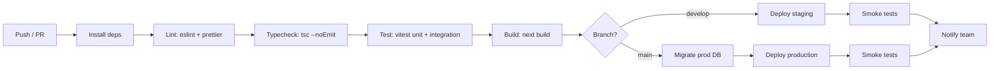

# Deployment Runbook — Enshrine Associate Management Portal

**Version:** 1.0 · **Source of truth:** `Enshrine_Portal_PRD.md` v1.2 (§4 stack, §10 NFRs) · **References:** `08_Security_and_PDPA.md` (secrets, residency), `02_Database_Diagram.md` (schema/migrations)
**Stack:** Next.js (App Router, TypeScript) + PostgreSQL + Prisma + NextAuth/Auth.js + S3-compatible storage.
**Hosting:** Vercel + managed Postgres (Supabase / Neon / RDS), region **ap-southeast-1 (Singapore)**.

---

## 1. Environments

| Environment | Purpose | App | Database | Storage | Branch |
|---|---|---|---|---|---|
| **local** | Developer machines | `next dev` | local Postgres (Docker) | local MinIO / dev bucket | feature branches |
| **staging** | QA, UAT, pre-prod verification | Vercel Preview / staging project | managed Postgres (SG), separate instance | staging bucket (SG) | `develop` / PRs |
| **production** | Live | Vercel Production | managed Postgres (SG), prod instance | prod bucket (SG) | `main` |

- Each environment has **fully isolated** databases, storage buckets, and secrets (§7). No shared credentials.
- All managed Postgres and storage live in **ap-southeast-1** for PDPA data residency (`08_Security_and_PDPA.md` §6).

---

## 2. CI/CD pipeline

Triggered on PR (checks) and on merge to `develop` (→ staging) / `main` (→ production). Stages run in order; a failing stage blocks the rest.



**Stage detail**
1. **Lint** — `eslint` + `prettier --check` (see `11_Coding_Standards.md`).
2. **Typecheck** — `tsc --noEmit` (TypeScript strict).
3. **Test** — `vitest run` (unit + integration against an ephemeral Prisma test DB); Playwright e2e on staging post-deploy or nightly.
4. **Build** — `next build`; fails on type or build errors.
5. **Migrate** — `prisma migrate deploy` against the target DB (staging on `develop`, prod on `main`) **before** the new code serves traffic.
6. **Deploy** — Vercel deploy (preview for staging, production for `main`).
7. **Smoke tests** — post-deploy health check (auth, dashboard load, a read query) before marking the release good.

---

## 3. Database migration strategy

- **Prisma Migrate** is the single source of schema change. Schema in `prisma/schema.prisma`; migrations in `prisma/migrations/` and committed.
- **Local/dev:** `prisma migrate dev` (creates + applies + regenerates client).
- **Staging/prod:** `prisma migrate deploy` (applies committed migrations only; never generates). Run in CI **before** the new build serves traffic so schema is ahead of code.
- **Seed:** `prisma db seed` loads reference + prototype data (7 associates EN0001–EN0007, ≥1 company Enshrine, products incl. one external columbarium — DB §5). Seed runs on local/staging, **not** on production after go-live.
- **Expand/contract for breaking changes (zero-downtime):** ship additive migration first (new nullable column/table), deploy code that writes both/reads new, backfill, then a later migration drops the old — never drop-and-recreate in one step on prod.
- **Money/enum care:** money columns `NUMERIC(14,2)`; enums (`02_Database_Diagram.md` §3) changed via additive Postgres `ALTER TYPE ... ADD VALUE` where possible.

---

## 4. Backups & restore

- **Automated backups:** managed Postgres daily snapshots + point-in-time recovery (PITR/WAL), retained ≥ 7–30 days, **all in ap-southeast-1**.
- **Pre-deploy snapshot:** take a manual snapshot immediately before any production migration that is not purely additive.
- **Object storage:** versioning enabled on the prod bucket; lifecycle rules align with retention (`08_Security_and_PDPA.md` §7).
- **Restore procedure:**
  1. Identify target timestamp (before incident) from `audit_log` / monitoring.
  2. Provision a restore instance from snapshot/PITR (same region).
  3. Validate data integrity (associate counts, ledger reconciliation, latest payouts).
  4. Repoint `DATABASE_URL` (or promote restore) and redeploy.
  5. Reconcile financial ledger and notify stakeholders.
- **Restore drills:** rehearse restore on staging periodically; record RTO/RPO.

---

## 5. Rollback procedure

1. **App rollback (fast path):** in Vercel, **promote the previous production deployment** — instant, no DB change. Use when the defect is code-only and schema is unchanged/back-compatible.
2. **With migration:** if the bad release included a migration —
   - If the migration was **additive/back-compatible**: roll back the app only; the extra column/table is inert.
   - If the migration was **destructive**: restore the **pre-deploy snapshot** (§4) and redeploy the previous build. This is why non-additive migrations require a pre-deploy snapshot and the expand/contract pattern.
3. **Verify:** run smoke tests; confirm auth, dashboards, and a commission/payout read.
4. **Record:** log the rollback in the release tracker + `audit_log` context.

---

## 6. Monitoring, logging & error tracking

- **Error tracking:** Sentry (or equivalent) on Next.js client + server; alert on new/spiking errors.
- **Structured logs:** JSON logs from server actions/route handlers (no PII in logs — never log NRIC/bank/decrypted values per `08_Security_and_PDPA.md`).
- **Audit log:** in-app `audit_log` for privileged/financial actions (separate from infra logs).
- **Uptime/health:** `/api/health` endpoint + external uptime monitor; DB connection check.
- **Performance (PRD §10 NFR):** track dashboard latency (target < 2s at 1,000 associates) and commission-run/bank-file batch duration.
- **Alerts:** failed migrations, deploy failures, auth-lockout spikes, error-rate thresholds → team channel/email.

---

## 7. Secrets & environment management

Managed in **Vercel encrypted env vars**, per environment; never committed (local uses git-ignored `.env.local`).

| Variable | Purpose |
|---|---|
| `DATABASE_URL` | Postgres connection (`sslmode=require`), per env |
| `ENCRYPTION_KEY` | Column-level AES-256-GCM key for `nric` / `bank_account_number` (separate from DB creds) |
| `NEXTAUTH_SECRET` | Auth.js session signing |
| `NEXTAUTH_URL` | Per-env app URL |
| `S3_ENDPOINT` / `S3_BUCKET` / `S3_ACCESS_KEY_ID` / `S3_SECRET_ACCESS_KEY` | Object storage (SG region) |
| `SMTP_*` | Transactional email (notices, approvals, payout-paid) |

- Least-privilege service credentials; rotate on suspected compromise (`08_Security_and_PDPA.md` §11).
- Staging and prod never share `ENCRYPTION_KEY` or `DATABASE_URL`.

---

## 8. Release checklist

- [ ] PR approved; CI green (lint, typecheck, test, build).
- [ ] Migration reviewed; additive or expand/contract confirmed; **pre-deploy snapshot taken** if non-additive.
- [ ] Secrets/env present and correct for the target environment.
- [ ] Staging deployed; Playwright e2e + UAT (`09_Test_Plan.md` §10) green.
- [ ] Commission §8.2 example + reconciliation verified on staging.
- [ ] RBAC scoping spot-check (out-of-scope → 403).
- [ ] `prisma migrate deploy` applied to prod before traffic.
- [ ] Production deploy + smoke tests pass.
- [ ] Monitoring/alerts confirmed receiving; error tracker clean.
- [ ] Rollback path confirmed (previous deploy promotable / snapshot available).
- [ ] Release noted in tracker; team notified.

---

## 9. Zero-downtime notes

- **Schema-ahead-of-code:** `prisma migrate deploy` runs before the new build serves traffic; only additive/expand-contract migrations on prod.
- **Stateless app:** Next.js on Vercel scales horizontally; sessions are cookie-based (no sticky state).
- **Atomic invoice numbering** under concurrency: `companies.invoice_next_seq` allocated atomically (DB §4) so rolling deploys don't double-issue.
- **Idempotent commission engine:** safe to re-run after deploy; delete+reinsert per transaction avoids duplicate ledger lines.
- **Background jobs** (commission/payout/bank-file) guarded so a deploy mid-run doesn't double-process.

---

## 10. Singapore region note

All production infrastructure — Vercel functions (where region-pinnable), managed Postgres, object storage, backups, and replicas — is provisioned in **ap-southeast-1 (Singapore)** to satisfy PDPA data residency (`08_Security_and_PDPA.md` §6). No personal data is replicated or backed up outside the region. Any new third-party processor (email, future payment gateway) must offer SG-region processing before adoption.

> **Sections 1–10 above describe the managed (Vercel) hosting option from the PRD.** The project's **actual deployment target** is a self-hosted Docker server using a **server-pull (git + cron) model** — documented authoritatively in **Sections 11–14 below**. Where the two differ, Sections 11–14 govern the live server.

---

## 11. Deployment targets & connection details (live)

| Item | Value |
|---|---|
| **Git repository** | `git@github.com:Mavrone81/VirtualOffice.git` (branch `main`) |
| **Server (host)** | `165.22.246.45` |
| **SSH user** | `root` |
| **SSH command** | `ssh -o ServerAliveInterval=60 -o ServerAliveCountMax=5 -o TCPKeepAlive=yes -v root@165.22.246.45` |
| **App name (for scripts/logs)** | `virtualoffice` |
| **Repo path on server** | `g.` — *confirm during recon* (suggested: `/opt/virtualoffice` or `/root/VirtualOffice`) |
| **Compose file path on server** | `h.` — *confirm during recon* (e.g. `<repo>/docker-compose.yml`) |
| **This app's service name(s)** | `i.` — *confirm during recon* (suggested: `web`, `db`) |
| **Images** | `j.` — *confirm during recon* (default assumption: built locally via `build:`) |
| **Health check URL** | `l.` — *to confirm* (e.g. `http://165.22.246.45/api/health`) |
| **Environment** | staging / production — *to confirm (affects backup + downtime caution)* |

> ⚠️ The server may host **other apps**. Every command in Sections 12–14 targets **only the `virtualoffice` service(s)**. Never run `docker compose down -v`, `docker volume rm`, or a global prune that could affect unrelated containers.

> 🔐 **Secrets:** the live server `.env` and all volumes are **server-managed and git-ignored** — never committed, never overwritten by a deploy. Only `.env.example` (no real values) lives in git.

---

## 12. Phase 0 — server recon checklist (read-only, run first)

Run these **on the server** before any change; they are read-only and safe on a shared host:

```bash
# identity & repo
whoami; pwd
git -C <repo_path> remote -v && git -C <repo_path> branch && git -C <repo_path> status -s

# locate compose + see ALL services (so we know what NOT to touch)
ls -la <compose_path>
docker compose -f <compose_path> config --services
docker compose -f <compose_path> ps

# confirm images: built locally (build:) vs pulled (image:)
grep -nE 'build:|image:' <compose_path>

# confirm DB/uploads use named volumes or bind mounts (NOT container-local)
docker compose -f <compose_path> config | grep -nA3 -E 'volumes:'
docker volume ls

# confirm server can fetch the repo (deploy key / access)
GIT_SSH_COMMAND='ssh -o BatchMode=yes' git -C <repo_path> fetch --dry-run origin main

# cron available
systemctl is-active cron 2>/dev/null || systemctl is-active crond
```

Record: repo path, compose path, the exact `virtualoffice` service names, build-vs-image, the named volumes backing DB + uploads, and that `git fetch` works.

---

## 13. Phase 1 — local → GitHub (run on the Mac, from the project folder)

> The server receives code by **pulling from GitHub** — never by copying from the Mac.

```bash
cd "<local_project_folder>"        # the source of truth on the MacBook

# 1) init if needed
git init -b main

# 2) ensure hygiene BEFORE the first commit (see .gitignore template below)
#    -> create .gitignore and .env.example first, then:

# 3) sanity: confirm no secrets/data are staged
git add -A
git status            # verify NO .env, no data/ dirs, no uploads, no *.sqlite

# 4) first commit + remote + push
git commit -m "chore: initial commit (code + docs + deploy config)"
git remote add origin git@github.com:Mavrone81/VirtualOffice.git
git push -u origin main
```

**`.gitignore` (root) — commit this; it keeps data & secrets out of git:**
```gitignore
# secrets / env
.env
.env.*
!.env.example
*.pem
*.key

# node / next
node_modules/
.next/
out/
dist/
build/
coverage/
*.log
npm-debug.log*

# data & persistent state (named volumes / bind mounts live on the SERVER, never in git)
data/
postgres-data/
pgdata/
uploads/
storage/
*.sqlite
*.sqlite3
db_backups/
*.dump

# os / editor
.DS_Store
.idea/
.vscode/
```

**`.env.example` (root) — commit this template with NO real values** (mirror keys from `06_Environment_Configuration.md`): `DATABASE_URL`, `ENCRYPTION_KEY`, `NEXTAUTH_SECRET`, `NEXTAUTH_URL`, `S3_ENDPOINT/S3_BUCKET/S3_ACCESS_KEY_ID/S3_SECRET_ACCESS_KEY`, `SMTP_*`, and feature flags `PAYMENT_GATEWAY_ENABLED=false`, `FESTIVE_AI_ENABLED=false`, `GST_ENABLED=false`.

> **If any secret/data file is already tracked** in git: back it up, `git rm --cached <file>`, add it to `.gitignore`, commit a `.example`/`.default` template in its place, then (for prod) rotate the exposed secret.

**Verify Phase 1:** GitHub shows the code + docs; **no `.env` or data committed**; branch = `main`; `git status` clean.

---

## 14. Phase 2 — server-pull CI/CD (cron + git, no repo secrets)

**Model:** `git push main` → the server's cron job (every minute) detects the new commit, hard-resets **code only** (volumes & `.env` are git-ignored and survive), and rebuilds **only** the `virtualoffice` service(s). No GitHub Actions runner, no repo secrets.

> ⚠️ **First-time setup, do before enabling cron:** back up the DB + `.env`:
> ```bash
> # DB dump (adjust service/credentials)
> docker compose -f <compose_path> exec -T db pg_dumpall -U postgres > /root/virtualoffice-db-$(date +%F).sql
> cp <repo_path>/.env /root/virtualoffice.env.bak-$(date +%F)
> ```

**Deploy script — `/root/auto-deploy-virtualoffice.sh`:**
```bash
#!/usr/bin/env bash
set -euo pipefail

# cron has a minimal PATH — set it explicitly (adjust if docker/git live elsewhere)
export PATH=/usr/local/sbin:/usr/local/bin:/usr/sbin:/usr/bin:/sbin:/bin

REPO="<repo_path>"                 # e.g. /opt/virtualoffice
COMPOSE="<compose_path>"           # e.g. /opt/virtualoffice/docker-compose.yml
SERVICES="web"                     # ONLY this app's service(s); space-separated e.g. "web worker"
LOG_TS() { date '+%Y-%m-%d %H:%M:%S'; }

cd "$REPO"
git fetch origin main --quiet

LOCAL=$(git rev-parse @)
REMOTE=$(git rev-parse origin/main)

if [ "$LOCAL" = "$REMOTE" ]; then
  exit 0                            # unchanged — exit quietly (keeps the log clean)
fi

echo "[$(LOG_TS)] New commit $REMOTE — deploying $SERVICES"
git reset --hard origin/main       # CODE ONLY — volumes & .env are git-ignored and untouched

# Build locally (default). If using a registry, replace the next line with:
#   docker compose -f "$COMPOSE" pull $SERVICES && docker compose -f "$COMPOSE" up -d $SERVICES
docker compose -f "$COMPOSE" up -d --build $SERVICES

docker image prune -f              # dangling images only — safe; never prune volumes
echo "[$(LOG_TS)] Deploy complete: $(git rev-parse --short @)"
```

```bash
chmod +x /root/auto-deploy-virtualoffice.sh
```

**Crontab (root) — every minute, flock prevents overlap:**
```cron
* * * * * flock -n /tmp/virtualoffice-deploy.lock /root/auto-deploy-virtualoffice.sh >> /var/log/virtualoffice-deploy.log 2>&1
```
Install with `crontab -e` (as root); confirm with `crontab -l` and `systemctl is-active cron`.

**Safety rules baked into the script**
- Targets **only** `$SERVICES` — `up -d --build web` recreates just `web`; `db` and unrelated services stay up.
- **Never** `docker compose down -v` / `docker volume rm` — DB + uploads live in **named volumes / bind mounts** and survive every deploy.
- `git reset --hard origin/main` only moves **tracked code**; `.env` and data dirs are git-ignored, so they are never overwritten.
- `docker image prune -f` removes **dangling** images only (no volumes, no named images in use).
- `flock` ensures a slow build never overlaps the next minute's run.

**Zero-downtime flag:** `up -d --build web` briefly restarts `web`. If `web` must serve with no gap, add a Docker `healthcheck` and do a rolling restart (run a second replica / blue-green) instead of in-place recreate — call this out before enabling on production.

**Verify Phase 2 end-to-end (don't claim success until proven):**
1. `systemctl is-active cron` → active; `crontab -l` shows the job.
2. Make one small **code** change on the Mac (e.g. a version string), `git push origin main`.
3. On the server, poll until deployed: `watch -n5 'git -C <repo_path> rev-parse --short @'` until it matches the pushed commit.
4. `tail -n 40 /var/log/virtualoffice-deploy.log` shows the new-commit deploy.
5. Health check: `curl -i <health_url>` → **HTTP 200**; `docker compose -f <compose_path> ps` shows `web` healthy.
6. Confirm **only** `virtualoffice` services were recreated (others' `STATUS`/uptime unchanged).

> **Status:** this section is a **runbook to execute on the Mac + server** (the app code must exist first). It was authored as documentation only — no commands have been run against GitHub or `165.22.246.45` from here.

---

*References: `Enshrine_Portal_PRD.md` (master), `08_Security_and_PDPA.md` (secrets/residency), `02_Database_Diagram.md` (schema/migrations), `06_Environment_Configuration.md` (env vars), `TESTING.md` (test suite).*
